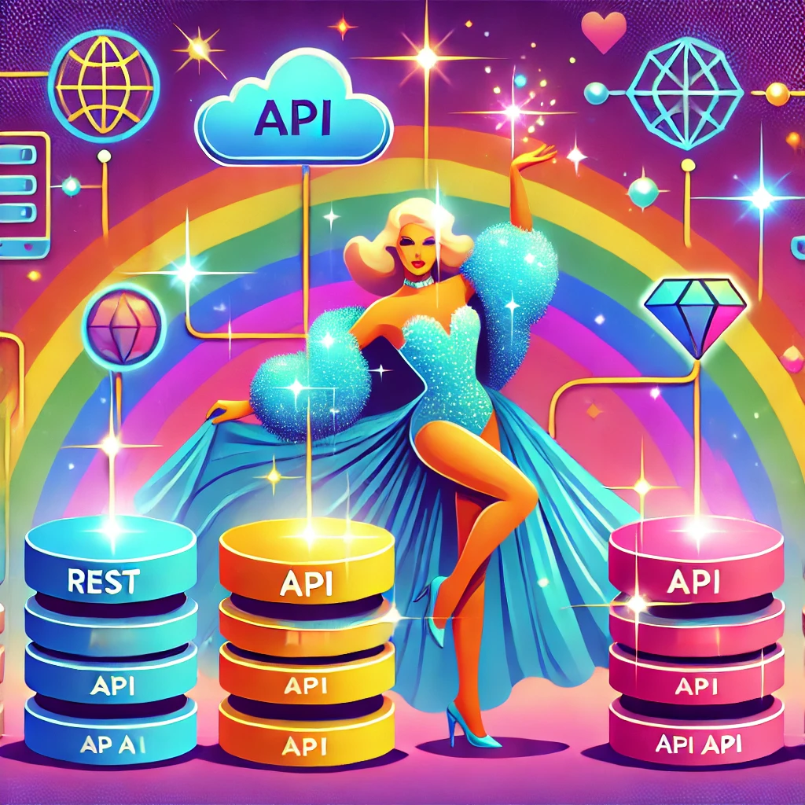

# 🌈✨ Bem-vindes ao API Gateway MAIS FABULOSO da Internet! ✨🌈



💖 Se joga nessa aventura tecnológica repleta de REST, SOAP e integração arrasadora! Aqui, nosso API Gateway chiquérrimo conecta todas as partes com um glamour inigualável – e o melhor de tudo: agora, TUDO está containerizado! Nada de rodar cada serviço separadamente, miga, é Docker, é Docker, é Docker! 💃🎉

---

## 🎭 O que temos por aqui?

- **API Gateway arrasando com Node.js**
- **API REST poderosa rodando no Django**
- **API SOAP glamourosa via WCF**
- **HATEOAS esbanjando links porque a conexão é diva!**
- **Documentação via Swagger pra deixar tudo claríssimo!**
- **E o melhor:** Todo o sistema containerizado para você não perder tempo e arrasar sempre!

---

## 🎀 Como rodar TUDO (com Docker) e brilhar sem perrengues!

### 🔥 1. Preparando o ambiente
Antes de mais nada, certifique-se de ter instalados:
- **Docker** e **Docker Compose**

Sem esses, não tem como entrar na onda dessa tecnologia fabulosa!

---

### 🚀 2. Subindo o show completo com Docker
Na raiz do repositório (onde estão as pastas `api-rest`, `api-soap-wcf` e `api-gateway`), basta rodar:

```sh
docker-compose up --build
```

E pronto!  
- A **API REST (Django)** subiu lindamente em [http://localhost:8000](http://localhost:8000)
- A **API SOAP (WCF)** está um arraso em [http://localhost:5000/Service.svc](http://localhost:5000/Service.svc)
- O **API Gateway (Node.js)** tá poderosíssimo em [http://localhost:3000](http://localhost:3000)
- E o **Redis** (para a fila de mensagens) também tá no rolê, sustentando toda a magia!

Esqueça a bagunça de instalar dependências e rodar comandos separadamente – agora é só subir os containers e deixar a tecnologia trabalhar por você, com muito brilho e sem stress! ✨💖

---

### 3. Fila de mensagens *-*

```js

// Rota de logout
app.post("/logout", (req, res) => {
  req.session.destroy((err) => {
    if (err) {
      res.status(500).json({ error: "Erro ao realizar logout." });
    } else {
      res.json({ message: "Logout realizado com sucesso!" });
    }
  });
});

// Rota de autenticação via SOAP usando fila
app.post("/auth", async (req, res) => {
  const { email, password } = req.body;
  const job = await authQueue.add({ email, password });
  job.finished()
    .then((result) => res.send(result))
    .catch(() => res.status(500).json({ error: "Erro ao autenticar usuário" }));
});

```

### 💅 4. Testando o espetáculo!

- 🌍 **Documentação via Swagger:**  
  Encante-se com [http://localhost:3000/api-docs](http://localhost:3000/api-docs) – tudo documentado com muito glamour!

- 🔥 **Testar a API REST:**  
  Experimente o `GET http://localhost:3000/users` e veja os usuários arrasando com links HATEOAS que brilham mais que glitter!

- 💖 **Autenticação via API SOAP:**  
  Faça um `POST http://localhost:3000/auth` com o corpo:
   ```json
   {
      "email": "barbie",
      "password": "ken"
   }
   ```
  Sinta a energia de um login super poderoso que ainda dispara notificações com estilo!

---

## 🎉 Agora é só brilhar, diva!

Você tem um sistema COMPLETO, containerizado e integradíssimo, rodando com REST, SOAP e um API Gateway que é pura elegância! Esqueça as complicações – aqui a tecnologia foi feita para facilitar sua vida e fazer você brilhar! Se tiver dúvidas, chama as amigas devs ou dá aquele Google maroto – aqui a gente sempre arrasa junto! 🚀💖

---

Agora, prepare-se para se apaixonar por essa obra-prima da integração tecnológica – porque, no nosso mundo, cada linha de código é um desfile de moda digital! 🌈✨